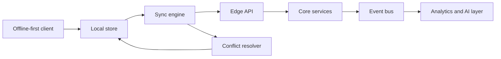

<!-- TOP BANNER -->


<div align="center">

<!-- GLITCH TYPING -->


<br/>

<!-- MATRIX LINE -->


<br/><br/>

<!-- SOCIALS -->
<a href="https://linkedin.com/in/sagarkotai">

</a>

<a href="mailto:sagarkotai9899@gmail.com">

</a>

<a href="https://github.com/SagarKotai">

</a>

<br/><br/>


</div>

---


# `> whoami`

```ts
const sagar = {
    role: "Full-Stack and AI Systems Engineer",

    location: "Udaipur, Rajasthan, India",

    focus: [
        "AI systems",
        "Multi-agent workflows",
        "Offline-first SaaS",
        "Real-time architectures"
    ],

    currently_building: [
        "Production AI SaaS",
        "LangGraph agents",
        "Scalable backend systems"
    ],

    tech_stack: {
        frontend: ["React", "Next.js", "TypeScript"],
        backend: ["Node.js", "FastAPI", "MongoDB", "Redis"],
        ai: ["LangChain", "LangGraph", "RAG", "LLMs"]
    },

    philosophy: "Build systems that survive real-world scale."
};
```

<br clear="right"/>

---

# Tech Arsenal

<div align="center">

### AI and ML


<br/>

### Full Stack


<br/>

### Database and Infra


</div>

---

# Signature Builds

<div align="center">

<table>
<tr>
<td width="50%">

## SwadSync

### Offline-first Restaurant POS SaaS

```bash
> Real businesses.
> Real users.
> Real-world scale.
```

### Features

- LAN real-time sync
- Offline .exe + Cloud PWA
- WhatsApp bill delivery
- Razorpay SaaS billing
- Multi-device synchronization

### Stack

`React` `Node.js` `MongoDB`
`Electron` `Redis` `Socket.IO`

### Links

[Website](https://www.swadsync.in)

</td>

<td width="50%">

## LeadForge

### Multi-agent AI Lead Intelligence System

```bash
> AI agents reasoning over lead pipelines.
```

### Features

- 5-agent LangGraph workflow
- AI lead scoring
- Personalized outreach generation
- FastAPI AI layer
- SaaS analytics dashboard

### Stack

`Python` `FastAPI`
`LangGraph` `React`

### Links

[GitHub](https://github.com/SagarKotai/LeadForge)

</td>
</tr>

<tr>
<td width="50%">

## PropRadar

### AI Real Estate Intelligence Platform

```bash
> Deterministic scoring plus AI reasoning.
```

### Features

- Multi-signal scoring engine
- AI-powered property analysis
- LangGraph agent pipeline
- India-focused real estate insights

### Stack

`FastAPI` `Node.js`
`React` `LangGraph`

### Links

[GitHub](https://github.com/SagarKotai/propRadar)

</td>

<td width="50%">

## Campusyantra

### Multi-tenant School ERP SaaS

```bash
> Full institution management ecosystem.
```

### Features

- RBAC architecture
- Payroll and taxation engine
- Academic workflow automation
- Tenant-isolated infrastructure

### Stack

`Next.js` `MongoDB`
`Redux` `Node.js`

</td>
</tr>
</table>

</div>

---

# Architecture DNA



---

# GitHub Analytics

<div align="center">


<br/><br/>


</div>

---

# Achievement Unlocked

<div align="center">

```diff
+ WorldQuant Brain - Research Consultant

# Master Level
# Top ~8% Globally
# Quantitative Alpha Research
# $2,000 Performance Bonus
```

</div>

---

# Currently Exploring

```yaml
ai_agents:
  - LangGraph orchestration
  - Multi-agent reasoning
  - Tool-using autonomous systems

backend_systems:
  - Event-driven architectures
  - Distributed sync systems
  - Real-time communication

learning:
  - Advanced AI engineering
  - Scalable SaaS infrastructure
  - System design
```

---

<div align="center">


</div>

<!-- FOOTER -->

